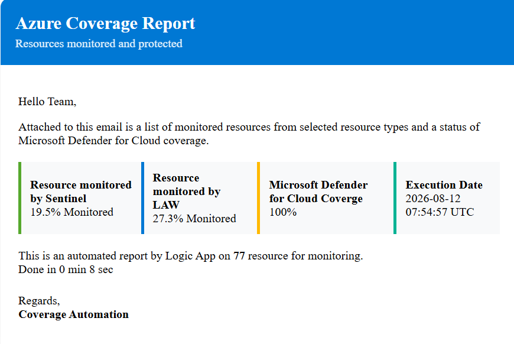

# Azure Coverage Report – Logic App

[](https://portal.azure.com/#create/Microsoft.Template/uri/https%3A%2F%2Fraw.githubusercontent.com%2FYinonGindi%2FMicrosoft_Sentinel%2Fmain%2FAutomation%2FAzureCoverageReport%2Fazuredeploy.json)

## Overview

This Logic App reports how well your Azure estate is covered by monitoring and security tooling, then emails the result on a schedule (default: monthly).

It answers three questions:

1. **Which resources send diagnostic logs to a Microsoft Sentinel workspace?**
2. **Which resources send diagnostic logs to a Log Analytics workspace that is *not* Sentinel-enabled?**
3. **How many Microsoft Defender for Cloud plans are enabled across your subscriptions?**

Every resource in scope is classified into one of five states:

| Status | Meaning |
|---|---|
| `Sentinel` | Diagnostic settings point at a Sentinel-enabled workspace |
| `Monitored` | Diagnostic settings point at a Log Analytics workspace without Sentinel |
| `Other` | Diagnostic settings exist, but target a non-workspace sink (Event Hub, Storage) |
| `Not Monitored` | No diagnostic settings configured |
| `Error` | The diagnostic settings API call failed for that resource |

The report is delivered as an HTML email with two attachments: `Coverage.csv` (the full per-resource inventory) and `mdc.html` (a Defender for Cloud plan breakdown).

## Sample Report

<p align="center">
  
</p>

### Resource Graph pagination

Resource Graph returns at most 1,000 rows per call. The `Until` loop repeatedly calls the API with the returned `$skipToken`, merging each page into the `Resources` variable, until no token is returned. The loop is capped at **60 iterations** with a **1-hour timeout** — roughly 60,000 resources.

## Prerequisites

1. An Azure subscription with permission to deploy resources and to create role assignments
2. An Office 365 / Exchange Online mailbox that can be used to send the report
3. Resources with **diagnostic settings** configured, so there is something to measure

## Deployment Parameters

| Parameter | Required | Default | Description |
|---|---|---|---|
| `logicAppName` | | `Sentinel-AzureCoverageReport` | Name of the Logic App resource |
| `location` | | Resource group location | Azure region for the Logic App and API connection |
| `recipientEmail` | ✅ | — | Email address that receives the coverage report (prompted by the deploy button) |
| `emailSubject` | | `Azure Coverage Report` | Subject line of the report email |
| `recurrenceFrequency` | | `Month` | How often the report runs (`Day`, `Week`, `Month`) |
| `recurrenceInterval` | | `1` | Number of frequency units between runs |
| `recurrenceTimeZone` | | `UTC` | Time zone used to evaluate the schedule |
| `logicAppState` | | `Disabled` | Deploy the Logic App enabled or disabled |

The only value you must supply is **`recipientEmail`**. Everything else has a working default.

### Scope and resource types

The report covers **every subscription the managed identity can read**, and checks 29 resource types that support diagnostic settings: API Management, Automation Accounts, Redis, Cognitive Services, Virtual Machines, Container Registries, AKS, MariaDB/MySQL/PostgreSQL, Cosmos DB, Data Collection Rules, Key Vaults, Logic Apps, Machine Learning, Application Gateways, Azure Firewall, Bastion, DDoS plans, Front Door, NSGs, Recovery Services Vaults, SQL, SQL VMs, Storage Accounts, Synapse, and App Service.

Both are set inside the workflow's Resource Graph queries. To narrow the scope, edit the `Get_all_Azure_Resources_using_Graph` action in the Logic App designer — add subscription IDs to the `subscriptions` array, or change the `where type in (...)` list.

## What Gets Deployed

| Resource | Type | Purpose |
|---|---|---|
| Logic App | `Microsoft.Logic/workflows` | The reporting workflow, with a system-assigned managed identity |
| API Connection | `Microsoft.Web/connections` | Office 365 connector used to send the email |

> No role assignments are created by this template — see below.

## Post-Deployment

> **Important:** The Logic App is deployed in a **Disabled** state. Complete both steps below, then enable it.

### 1. Authorize the Office 365 connection

The API connection is created but not authenticated. In the Azure portal, open the connection (name from the `office365ConnectionName` output), select **Edit API connection**, and click **Authorize** with the mailbox that should send the report. Save.

### 2. Assign roles to the managed identity

The workflow reads Resource Graph, diagnostic settings, and Defender for Cloud pricing. Grant the Logic App's system-assigned identity the following at the **subscription** or **management group** scope you want reported:

| Role | Why |
|---|---|
| `Reader` | Resource Graph queries and `Microsoft.Insights/diagnosticSettings/read` |
| `Security Reader` | The `securityresources` / `Microsoft.Security/pricings` query |

Take `managedIdentityPrincipalId` from the deployment outputs, then:

```bash
# Subscription scope
az role assignment create \
  --assignee "<managed-identity-principal-id>" \
  --role "Reader" \
  --scope "/subscriptions/<sub>"

az role assignment create \
  --assignee "<managed-identity-principal-id>" \
  --role "Security Reader" \
  --scope "/subscriptions/<sub>"
```

```bash
# Management group scope (recommended for multi-subscription reporting)
az role assignment create \
  --assignee "<managed-identity-principal-id>" \
  --role "Reader" \
  --scope "/providers/Microsoft.Management/managementGroups/<mg-id>"

az role assignment create \
  --assignee "<managed-identity-principal-id>" \
  --role "Security Reader" \
  --scope "/providers/Microsoft.Management/managementGroups/<mg-id>"
```

Role assignments can take a few minutes to propagate.

### 3. Enable the Logic App

```bash
az logic workflow update \
  --resource-group "<rg>" \
  --name "<logic-app-name>" \
  --state Enabled
```

Then use **Run Trigger** in the portal to confirm the first report arrives.

## Notes

- **Identity:** the workflow authenticates to `https://management.azure.com` with its **system-assigned managed identity**. No user-assigned identity or app registration is required.
- **Scope:** the Resource Graph queries use an empty `subscriptions` array, which means "every subscription the managed identity can read". Grant the roles at a management group to cover the whole tenant, or at a single subscription to limit the report.
- **Scheduling:** the trigger sets only `frequency`, `interval` and `timeZone`, with no `startTime`, so the schedule begins when you enable the Logic App. `recurrenceTimeZone` has no effect unless a start time is added — and if you do add one, combining `timeZone: UTC` with a start time is rejected by the runtime (`InvalidWorkflowTriggerRecurrence`). Use a `yyyy-MM-ddTHH:mm:ssZ` value with no `timeZone` instead.
- **Runtime:** the email includes an elapsed-time footer calculated from the `StartTime` variable.
- **Sentinel detection:** a workspace is treated as Sentinel-enabled when a `microsoft.operationsmanagement/solutions` resource named `SecurityInsights(<workspace>)` exists. A resource is marked `Sentinel` when any of its diagnostic settings target one of those workspaces.
- **Concurrency:** the per-resource loop runs 50 iterations in parallel. Lower this in the designer if you hit API throttling on very large estates.
- **Failure tolerance:** `Get_Settings` is allowed to fail per resource (`runAfter` accepts `Succeeded` and `Failed`); those resources are reported as `Error` rather than failing the run.
- **Empty results:** the percentages in the email divide by the resource and subscription counts. If a query returns nothing — for example, the role assignment has not propagated yet — the email action will fail on a division by zero. Verify roles before enabling.
- **Percentage baseline:** the headline percentages divide by `totalRecords` from the **last** Resource Graph page rather than the accumulated total. On estates small enough to fit in a single page (under 1,000 resources) this is exact; above that the percentages read high. The CSV attachment is always complete and authoritative.
- **Runtime:** the email includes an elapsed-time footer calculated from the `StartTime` variable.

## Deployment Outputs

| Output | Description |
|---|---|
| `logicAppName` | Name of the deployed Logic App |
| `managedIdentityPrincipalId` | Principal ID of the system-assigned identity (use for role assignments) |
| `office365ConnectionName` | Name of the Office 365 API connection that needs authorizing |
